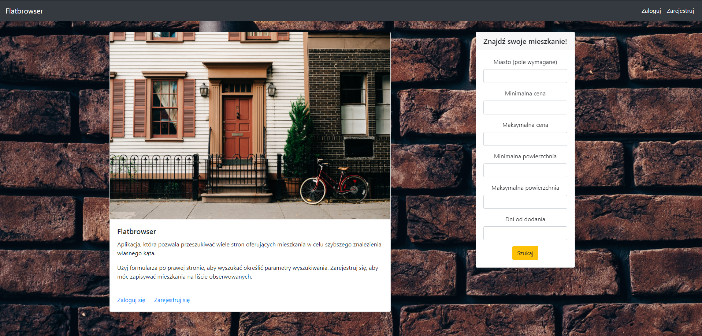
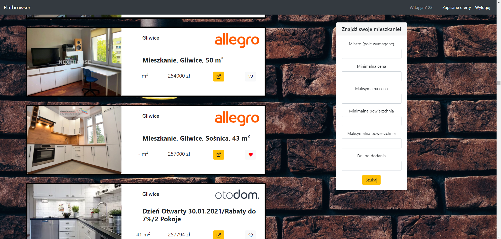
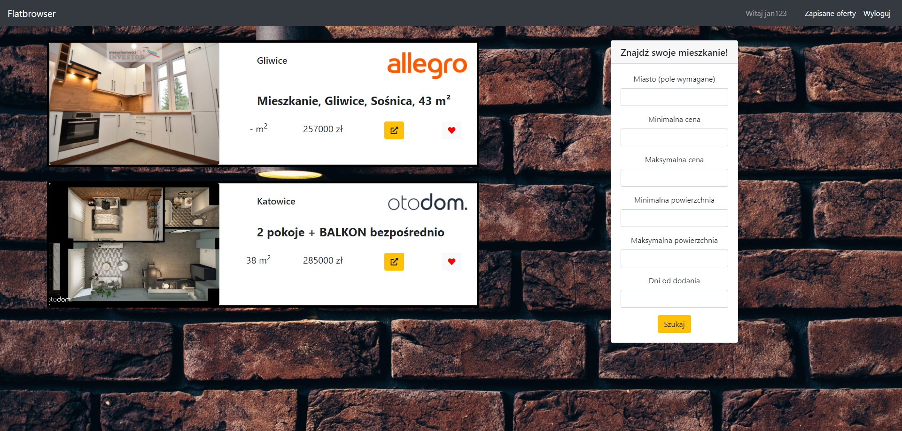
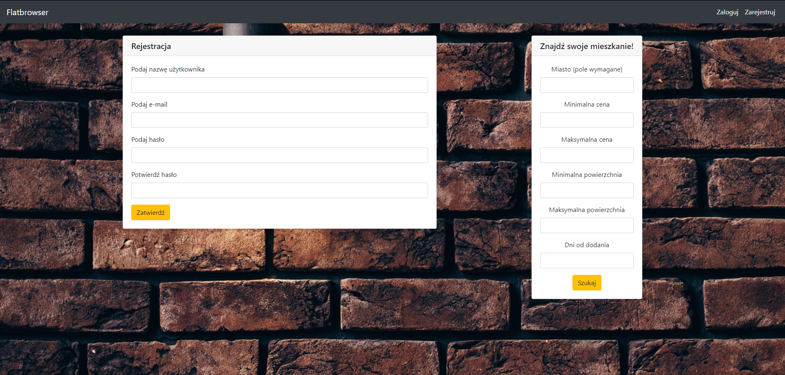

# URL Adress
https://flatbrowser.herokuapp.com/

# Flat-browser
> This application enables to browse flat offers in chosen city, price and surface area in your webbrowser. It collects data from external API and using webscraping.
## Table of contents
* [Screenshots](#screenshots)
* [Technologies](#technologies)
* [How it work?](#how-it-works)
* [Setup](#setup)
* [Features](#features)
* [Status](#status)
* [Contact](#contact)

## Screenshots

* Home page

* Results page

* Watchlist page

* Registration page

## Technologies
* Python 3.8.1
* Django 3.1.5
* MySQL
* BeautifulSoup4
* Bootstrap
* requests
* datetime
* relativedelta

## How it works?
Application collects data in two ways from three sources:
* By scrapping offers using BeautifulSoup4 from otodom.pl and morizon.pl,
* By getting offers from Allegro API.

To start collecting data user needs to fullfil search form. Found offers are saved in database (if they're not already there) and displayed.

Displaying is different depending on user is logged in or not. If user have logged in displayed offers are possible to be saved in or deleted from watchlist. In other case there's no such option.

## Setup
To install and run app you will need to:
* Clone this repository to your computer or unpack .zip file in chosen directory,
* Run IDE or command line,
* Command in IDE to install demanded packages:
> pip install -r requirements.txt
* Run comand line,
* Type "cd YOUR_DIRECTORY\flatbrowser" in command line,
* Type "python manage.py runserver 8000" in command line,
* Type "http://127.0.0.1:8000/" in your webbrowser.

## Features

* Function of scrapping data from otodom.pl and morizon.pl using BeautifulSoup4,
* Function of getting data from Allegro API,
* Displaying data on website basing on user paramethers (city, price, area, days from publication),
* User registration, login and logout,
* Displaying user's watchlist, 
* Adding to and deleting offers from watchlist.

## Status
Ready to use. Uploaded on Heroku. Needs responsiveness improvements.
## Contact
Created by [@matedawid](https://linkedin.com/in/matedawid) - if you have any questions, just contact me!
